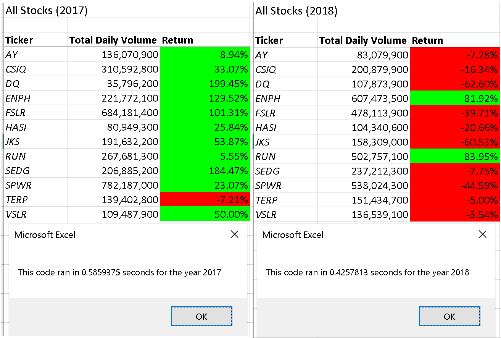
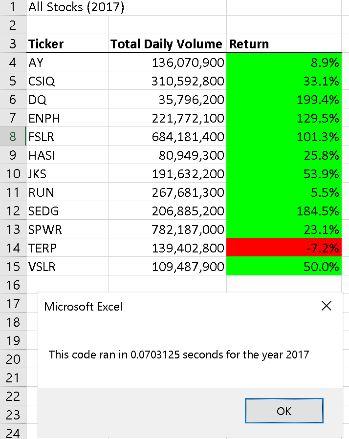
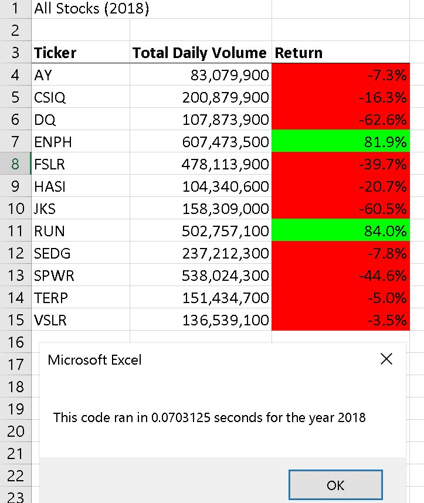

# stock-analysis

## Overview of Project

### Purpose

We were tasked with refactoring code created for collecting data about stocks from green energy companies. 

### Analysis and Results of Data

When originally coded, our macro program was able to successfully run through all the data points and correctly display the results of trading volume and the return of investment of each stock for that year.

When looking at figure 1, you can see that our code was able to  run through all the data and give us results for each of the stocks. 

**Figure 1**: Original code results

Once we refactored the code to run through any number of stocks, the amount of time needed was significantly shorter as you can see in figures 2 and 3.

**Figure 2**: Refactored Code results for 2017

**Figure 3**: Refactored Code results for 2018

## Conclusion

The original code was simple and easier to follow along, but it also took a significantly longer time to run. 
The refactored code was shorter in length using less loops, but harder to follow along for newer users. It also ran faster than the original code. This was due to only using one for loop versus multiple loops. I personally think that if we were to add more functionality to the code, it would be better to use the refactored code as it more concise and was able to run faster, which if you were trying to add more years or more data, would be better If you were going to have Steve change the code or someone else, I would probably stick with the original code for ease of use.
